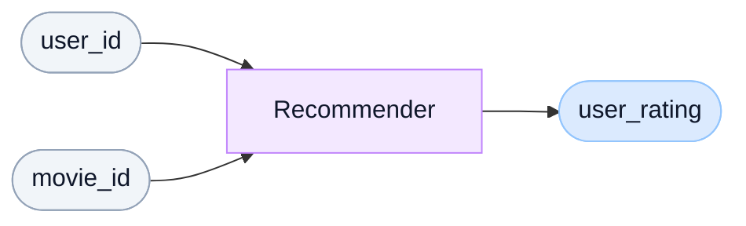
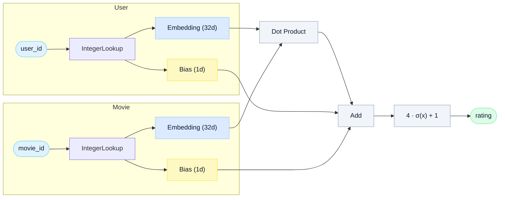

# Introduction to Embedding-Based<br>Recommender Systems

Matrix factorization from scratch in PyTorch

<div class="abs-br m-6 text-sm opacity-60">Dr. Robert Kübler</div>

---
clicks: 3
class: flex flex-col
---

# They are everywhere!

<div class="flex-1 flex items-center justify-around gap-16">
  <v-click>
  <div class="flex flex-col items-center gap-4">
    <div class="text-5xl font-bold" style="color:#E50914">Netflix</div>
    <StatCounter :target="75" suffix="%" caption="of views come from recommendations" />
  </div>
  </v-click>
  <v-click>
  <div class="flex flex-col items-center gap-4">
    <div class="text-5xl font-bold" style="color:#FF0000">YouTube</div>
    <StatCounter :target="60" suffix="%" caption="of home-screen clicks" />
  </div>
  </v-click>
  <v-click>
  <div class="flex flex-col items-center gap-4">
    <div class="text-5xl font-bold" style="color:#FF9900">Amazon</div>
    <StatCounter :target="35" suffix="%" caption="of sales from cross-sell" />
  </div>
  </v-click>
</div>

<div class="abs-b mb-6 text-xs opacity-50 text-center font-mono">
  Jannach and Jugovac, Measuring the Business Value of Recommender Systems, 2019
</div>

<!--
Whether you open Netflix, YouTube, or Amazon, a model is quietly deciding what you see next.
-->

---
clicks: 3
class: flex flex-col
---

# Today

<div class="flex-1 flex flex-col justify-center">
<v-clicks>

1. Design a simple collaborative recommender
2. Build it in PyTorch, three versions
3. Understand what it can and cannot do

</v-clicks>
</div>

---
clicks: 5
---

# Example data: MovieLens-1M

<table class="mt-4 text-sm w-full border-collapse font-mono">
  <thead>
    <tr class="border-b-2 border-gray-200">
      <th class="py-2 px-3 text-left opacity-30">timestamp</th>
      <th class="py-2 px-3 text-left">user_id</th>
      <th class="py-2 px-3 text-left">movie_id</th>
      <th class="py-2 px-3 text-left">user_rating</th>
      <th class="py-2 px-3 text-left opacity-30">movie_genres</th>
      <th class="py-2 px-3 text-left opacity-30">user_gender</th>
      <th class="py-2 px-3 text-left opacity-30">...</th>
    </tr>
  </thead>
  <tbody>
    <tr class="border-b border-gray-100">
      <td class="py-2 px-3 opacity-30">978300760</td><td class="py-2 px-3">1</td><td class="py-2 px-3">1193</td><td class="py-2 px-3">5</td><td class="py-2 px-3 opacity-30">Drama</td><td class="py-2 px-3 opacity-30">F</td><td class="py-2 px-3 opacity-30">...</td>
    </tr>
    <tr class="border-b border-gray-100">
      <td class="py-2 px-3 opacity-30">978302109</td><td class="py-2 px-3">1</td><td class="py-2 px-3">661</td><td class="py-2 px-3">3</td><td class="py-2 px-3 opacity-30">Animation</td><td class="py-2 px-3 opacity-30">F</td><td class="py-2 px-3 opacity-30">...</td>
    </tr>
    <tr class="border-b border-gray-100">
      <td class="py-2 px-3 opacity-30">978301968</td><td class="py-2 px-3">1</td><td class="py-2 px-3">914</td><td class="py-2 px-3">3</td><td class="py-2 px-3 opacity-30">Musical</td><td class="py-2 px-3 opacity-30">F</td><td class="py-2 px-3 opacity-30">...</td>
    </tr>
    <tr class="border-b border-gray-100">
      <td class="py-2 px-3 opacity-30">978300275</td><td class="py-2 px-3">1</td><td class="py-2 px-3">3408</td><td class="py-2 px-3">4</td><td class="py-2 px-3 opacity-30">Drama</td><td class="py-2 px-3 opacity-30">F</td><td class="py-2 px-3 opacity-30">...</td>
    </tr>
  </tbody>
</table>

<p class="caption">(1,000,000 rows.)</p>

<v-click :at="1">

Things to build:

</v-click>

<div class="mt-2 ml-4 flex flex-col gap-1 text-sm">
  <div class="flex items-center gap-3">
    <v-click :at="2"><span>1. <strong>collaborative filtering</strong>: only use user_id and movie_id to predict user_rating</span></v-click>
    <v-click :at="5"><span class="font-mono text-blue-500">&lt;- focus on this first</span></v-click>
  </div>
  <v-click :at="3"><div>2. <strong>content-based recommender</strong>: only use user features (gender, age, ...) and movie features (genre, year, ...)</div></v-click>
  <v-click :at="4"><div>3. <strong>hybrid approach</strong>: use everything</div></v-click>
</div>

---
class: flex flex-col
---

# Regression task

<div class="flex-1 flex flex-col items-center justify-center gap-8">

<div style="height: 280px; width: 100%; display: flex; align-items: center; justify-content: center;">
<div style="transform: scale(2.5); transform-origin: center center;">



</div>
</div>

<p class="caption">That's the whole job.</p>
</div>

---
class: flex flex-col
---

# The core challenge

<div class="flex-1 flex flex-col items-center justify-center gap-10">

<p class="text-center text-base opacity-70 max-w-xl">
  A model only understands numbers. But a user or a movie is just a label, an ID with no numeric meaning.
</p>

<div class="flex items-center gap-6 font-mono text-lg">
  <div class="flex flex-col items-center gap-2">
    <div class="text-4xl">🧑</div>
  </div>
  <div class="text-3xl opacity-40">→</div>
  <div class="px-6 py-3 rounded-xl border-2 border-dashed border-purple-400 text-purple-600 font-bold text-xl">
    ?
  </div>
  <div class="text-3xl opacity-40">→</div>
  <div class="flex flex-col items-center gap-2">
    <div class="text-4xl">🔢</div>
  </div>
</div>

<p class="text-center text-base opacity-70 max-w-xl">
  The whole trick: find a function that maps each user and each movie to a vector of numbers that captures something meaningful.
</p>

</div>

---
disabled: true
---

# Time-based split

<div class="mt-10">
  <div class="flex rounded-lg overflow-hidden h-14 text-white font-mono text-sm">
    <div class="flex items-center justify-center" style="width:90%;background:rgb(59,130,246)">train (0 to 900k)</div>
    <div class="flex items-center justify-center" style="width:10%;background:rgb(239,68,68)">test</div>
  </div>
  <div class="flex justify-between mt-1 text-xs opacity-40 font-mono">
    <span>0</span><span>900k</span><span>1M</span>
  </div>
</div>

<div class="mt-6 border-2 border-amber-400 rounded-xl p-4 bg-amber-50 font-mono text-sm">
  user 1: 0 rows in train, 53 rows in test
</div>

<p class="mt-6 text-sm opacity-60">Some users and movies only appear in the test set. This is the cold-start problem. We'll come back to it.</p>

---
class: flex flex-col
---

# How **not** to do it
#### Part I: Use IDs directly

<div class="flex-1 flex flex-col justify-center gap-8">
<p class="text-sm opacity-70">It might be tempting to just pass the IDs directly into the model as numerical features. After all, we already have numbers.</p>

<div class="text-center">
  <div class="text-5xl font-mono mb-8">user_id = 8323</div>
  <p class="opacity-60 text-sm">These IDs are arbitrary. User 8323 is not "greater than" user 8322, and 8323 is not twice as relevant as user 4161. The model would learn garbage. 💀</p>
</div>
</div>

---
layout: two-cols-header
clicks: 1
---

# How **not** to do it
#### Part II: One-hot encoding

::left::

<div class="mt-4 flex flex-col gap-6">
  <OneHotVector :length="3" :hotIndex="0" label="Hot" size="lg" />
  <OneHotVector :length="3" :hotIndex="1" label="Mild" size="lg" />
  <OneHotVector :length="3" :hotIndex="2" label="Cold" size="lg" />
</div>

<p class="caption">Every category gets a unique vector with a single 1.</p>

::right::

<v-click>

<div class="flex justify-center mt-4">
  <div class="relative" style="width:360px;height:320px">
    <svg class="absolute inset-0" width="360" height="320" viewBox="0 0 360 320">
      <polygon points="180,90 300,250 60,250" fill="none" stroke="#94a3b8" stroke-width="2"/>
    </svg>
    <!-- bottom edge label -->
    <div class="absolute text-xs text-slate-400" style="top:258px;left:50%;transform:translateX(-50%)"><Math tex="d=\sqrt{2}" /></div>
    <!-- left edge label -->
    <div class="absolute text-xs text-slate-400" style="top:162px;left:40px"><Math tex="d=\sqrt{2}" /></div>
    <!-- right edge label -->
    <div class="absolute text-xs text-slate-400" style="top:162px;right:40px"><Math tex="d=\sqrt{2}" /></div>
    <div class="absolute flex justify-center" style="top:5%;left:50%;transform:translateX(-50%)">
      <OneHotVector :length="3" :hotIndex="0" label="hot" size="sm" />
    </div>
    <div class="absolute" style="bottom:15px;left:0%">
      <OneHotVector :length="3" :hotIndex="1" label="mild" size="sm" />
    </div>
    <div class="absolute" style="bottom:15px;right:0">
      <OneHotVector :length="3" :hotIndex="2" label="cold" size="sm" />
    </div>
  </div>
</div>

<p class="caption">Mild should be closer to Hot than Cold. One-hot loses that.</p>

</v-click>

---
class: flex flex-col
---

# How **not** to do it
#### Part II: One-hot encoding

<div class="flex-1 flex flex-col justify-center items-center gap-8">
  <OneHotVector :length="30" :hotIndex="7" size="sm" />

  <div class="text-center font-mono">
    <span class="text-5xl">length = 6040</span>
    <div class="text-sm opacity-60 mt-2">for MovieLens users</div>
  </div>

  <p class="caption">1 hot cell, 6039 zeros per user. Not practical.</p>
</div>

---
clicks: 12
class: flex flex-col
---

# Embeddings

<div class="flex-1 flex flex-col justify-center items-center gap-8">
  <div class="flex items-center gap-4">
    <EmbeddingVector
      size="lg"
      :visible="$clicks"
      :labels="['age', 'likes<br>horror', 'has<br>job', '...', '', '', '', '']"
      :labelsVisible="Math.max(0, $clicks - 8)"
      :values="[0.32, -0.81, 0.55, -0.12, 0.70, 0.04, -0.46, 0.93]"
      label="user 42"
    />
    <span
      class="font-mono text-sm transition-all duration-300"
      :style="{ color: 'rgb(59,130,246)', opacity: $clicks >= 12 ? 1 : 0, transform: $clicks >= 12 ? 'translateX(0)' : 'translateX(-6px)' }"
    >← to be learned</span>
  </div>
  <p class="caption">Shorter vectors, more meaning.</p>
</div>

---
zoom: 0.9
clicks: 2
class: flex flex-col
---

# Structure emerges from ratings alone

<div class="flex-1 flex items-center justify-center">
  <EmbeddingPlot :step="$clicks" />
</div>


---

# Same trick powers NLP

<div class="flex gap-3 items-end justify-center mt-6 overflow-hidden w-full">
  <div class="flex flex-col items-center gap-1">
    <EmbeddingVector size="sm" :showValues="false" :values="[0.3, -0.6, 0.4, 0.1, -0.2, 0.5]" />
    <span class="font-mono text-sm">The</span>
  </div>
  <div class="flex flex-col items-center gap-1">
    <EmbeddingVector size="sm" :showValues="false" :values="[0.8, 0.2, -0.5, 0.6, -0.1, 0.3]" />
    <span class="font-mono text-sm">cat</span>
  </div>
  <div class="flex flex-col items-center gap-1">
    <EmbeddingVector size="sm" :showValues="false" :values="[-0.4, 0.3, 0.7, -0.2, 0.5, -0.1]" />
    <span class="font-mono text-sm">sat</span>
  </div>
  <div class="flex flex-col items-center gap-1">
    <EmbeddingVector size="sm" :showValues="false" :values="[0.1, -0.3, 0.2, 0.8, -0.4, 0.6]" />
    <span class="font-mono text-sm">on</span>
  </div>
  <div class="flex flex-col items-center gap-1">
    <EmbeddingVector size="sm" :showValues="false" :values="[-0.2, 0.4, 0.1, -0.5, 0.7, 0.2]" />
    <span class="font-mono text-sm">the</span>
  </div>
  <div class="flex flex-col items-center gap-1">
    <EmbeddingVector size="sm" :showValues="false" :values="[0.5, -0.1, 0.6, 0.3, -0.4, 0.8]" />
    <span class="font-mono text-sm">mat</span>
  </div>
</div>

<div class="flex gap-3 items-center justify-center mt-10 font-mono">
  <div class="flex flex-col items-center gap-1">
    <EmbeddingVector size="sm" :showValues="false" :values="[0.6, 0.4, -0.2, 0.8, 0.1]" />
    <span>king</span>
  </div>
  <span class="text-2xl">−</span>
  <div class="flex flex-col items-center gap-1">
    <EmbeddingVector size="sm" :showValues="false" :values="[0.3, 0.1, -0.4, 0.2, -0.1]" />
    <span>man</span>
  </div>
  <span class="text-2xl">+</span>
  <div class="flex flex-col items-center gap-1">
    <EmbeddingVector size="sm" :showValues="false" :values="[-0.2, 0.6, 0.1, 0.3, 0.4]" />
    <span>woman</span>
  </div>
  <span class="text-2xl">≈</span>
  <div class="flex flex-col items-center gap-1">
    <EmbeddingVector size="sm" :showValues="false" :values="[0.1, 0.9, -0.5, 0.9, 0.6]" />
    <span>queen</span>
  </div>
</div>

<p class="caption">Every LLM is built on top of this idea.</p>

---

# Mechanically, just a lookup

<div class="flex items-center justify-center gap-4 mt-8 flex-wrap">
  <div class="flex flex-col items-center gap-2">
    <OneHotVector :length="6" :hotIndex="3" size="md" />
    <span class="font-mono text-xs opacity-50">one-hot</span>
  </div>
  <span class="text-2xl opacity-40">·</span>
  <div class="flex flex-col items-center gap-2">
    <div class="grid gap-1" style="grid-template-columns:repeat(4,28px)">
      <div v-for="i in 24" :key="i"
        class="h-7 rounded flex items-center justify-center font-mono"
        style="font-size:8px"
        :style="{
          background: (i >= 13 && i <= 16) ? 'rgb(59,130,246)' : '#f1f5f9',
          color: (i >= 13 && i <= 16) ? '#fff' : '#94a3b8'
        }">{{ (i >= 13 && i <= 16) ? ['0.3','-0.7','0.4','0.8'][i-13] : '0' }}</div>
    </div>
    <span class="font-mono text-xs opacity-50">W (6 × 4)</span>
  </div>
  <span class="text-2xl opacity-40">=</span>
  <div class="flex flex-col items-center gap-2">
    <EmbeddingVector size="md" :showValues="false" :values="[0.3, -0.7, 0.4, 0.8]" />
    <span class="font-mono text-xs opacity-50">embedding</span>
  </div>
  <span class="text-xl opacity-40 mx-2">≡</span>
  <div class="flex flex-col items-center gap-2">
    <EmbeddingVector size="md" :showValues="false" :values="[0.3, -0.7, 0.4, 0.8]" />
    <span class="font-mono text-xs opacity-50">direct lookup</span>
  </div>
</div>

<p class="caption">Mathematically identical. A lookup just skips the matmul.</p>

---
layout: center
---

<div class="flex flex-col items-center gap-6">
  <EmbeddingVector size="md" :values="[0.32, -0.81, 0.55, -0.12, 0.70, 0.04, -0.46, 0.93]" label="user 42" />
  <div class="text-5xl opacity-30">?</div>
  <EmbeddingVector size="md" :values="[0.44, -0.62, 0.71, -0.28, 0.55, 0.17, -0.39, 0.82]" label="movie 2571" />
  <div class="border-2 border-dashed border-gray-300 rounded-xl px-10 py-3 text-3xl opacity-30">?</div>
</div>

<p class="caption">How do we combine two vectors into one rating?</p>

---
clicks: 2
class: flex flex-col
---

# Dot product

<div class="flex-1 flex flex-col justify-center gap-6">
  <div class="flex justify-center">
    <DotProduct
      :step="$clicks"
      :vecA="[0.32, -0.81, 0.55, -0.12, 0.70, 0.04, -0.46, 0.93]"
      :vecB="[0.44, -0.62, 0.71, -0.28, 0.55, 0.17, -0.39, 0.82]"
      labelA="user 42"
      labelB="movie 2571"
      :pmax="0.8"
      size="md"
    />
  </div>
  <p class="caption">High when vectors align. Low when they don't. That's our similarity score.</p>
</div>

---

# Matrix factorization

<div class="flex items-center justify-center gap-6 mt-8 font-mono">
  <div class="flex flex-col items-center gap-2">
    <div class="grid gap-1" style="grid-template-columns:repeat(6,28px)">
      <div v-for="(v, i) in [5,0,0,3,0,0,0,4,0,0,5,0,0,0,3,0,0,4,0,5,0,0,0,3,4,0,0,0,0,0,0,0,5,0,3,0]" :key="i"
        class="h-7 rounded flex items-center justify-center text-xs"
        :style="{ background: v ? 'rgb(59,130,246)' : '#f1f5f9', color: v ? '#fff' : '#94a3b8' }">{{ v || '' }}</div>
    </div>
    <span class="text-xs opacity-50">R (6×6)</span>
  </div>
  <span class="text-2xl opacity-50">≈</span>
  <div class="flex flex-col items-center gap-2">
    <div class="grid gap-1" style="grid-template-columns:repeat(4,28px)">
      <div v-for="i in 24" :key="i" class="h-7 rounded"
        :style="{ background: `hsl(${(i * 37) % 360}, 55%, 78%)` }"></div>
    </div>
    <span class="text-xs opacity-50">U (6×4)</span>
  </div>
  <span class="text-2xl opacity-50">·</span>
  <div class="flex flex-col items-center gap-2">
    <div class="grid gap-1" style="grid-template-columns:repeat(6,28px)">
      <div v-for="i in 24" :key="i" class="h-7 rounded"
        :style="{ background: `hsl(${(i * 53 + 120) % 360}, 55%, 78%)` }"></div>
    </div>
    <span class="text-xs opacity-50">Mᵀ (4×6)</span>
  </div>
</div>

<div class="text-center mt-6 font-mono text-xl">R ≈ U · Mᵀ</div>

<p class="caption">Dot products everywhere means you are implicitly factoring a matrix.</p>

---
layout: center
---

<Transform :scale="2.5">

$$\hat{r}(u, m) = \mathbf{e}_u \cdot \mathbf{e}_m$$

</Transform>

---
clicks: 3
---

# Version 1

```python {all|6-8|10-13}
import torch
import torch.nn as nn

class MFModelV1(nn.Module):
    def __init__(self, n_users: int, n_movies: int, dim: int = 32):
        super().__init__()
        self.user_emb = nn.Embedding(n_users + 1, dim)
        self.movie_emb = nn.Embedding(n_movies + 1, dim)

    def forward(self, user_ids, movie_ids):
        u = self.user_emb(user_ids)
        m = self.movie_emb(movie_ids)
        return (u * m).sum(-1, keepdim=True)
```

---
layout: center
---

# Uh oh.

<div class="flex justify-center mt-8">
  <MetricBadge label="val MAE" :value="3.0" variant="bad" size="lg" />
</div>

<p class="mt-8 opacity-80">Worse than predicting the mean. Right? Not so fast.</p>

---
class: flex flex-col
---

# Output range mismatch

<div class="flex-1 flex flex-col justify-center gap-8">
<div class="flex justify-center">
  <svg width="580" height="80" viewBox="0 0 580 80">
    <line x1="30" y1="40" x2="550" y2="40" stroke="#94a3b8" stroke-width="2"/>
    <polygon points="550,40 540,35 540,45" fill="#94a3b8"/>
    <polygon points="30,40 40,35 40,45" fill="#94a3b8"/>
    <text x="22" y="36" text-anchor="middle" font-family="JetBrains Mono,monospace" font-size="12" fill="#64748b">-∞</text>
    <text x="558" y="36" text-anchor="middle" font-family="JetBrains Mono,monospace" font-size="12" fill="#64748b">+∞</text>
    <rect x="220" y="28" width="140" height="24" rx="4" fill="rgb(134,239,172)" opacity="0.7"/>
    <line x1="220" y1="24" x2="220" y2="56" stroke="#16a34a" stroke-width="2"/>
    <line x1="360" y1="24" x2="360" y2="56" stroke="#16a34a" stroke-width="2"/>
    <text x="220" y="70" text-anchor="middle" font-family="JetBrains Mono,monospace" font-size="12" fill="#16a34a">1</text>
    <text x="360" y="70" text-anchor="middle" font-family="JetBrains Mono,monospace" font-size="12" fill="#16a34a">5</text>
  </svg>
</div>

<p class="text-sm opacity-60 text-center">A dot product can output anything in ℝ. Ratings live in [1, 5]. The model wastes most of its capacity figuring that out.</p>
</div>

---

# Version 2, squash to [1, 5]

````md magic-move
```python
def forward(self, user_ids, movie_ids):
    u = self.user_emb(user_ids)
    m = self.movie_emb(movie_ids)
    return (u * m).sum(-1, keepdim=True)
```

```python
def forward(self, user_ids, movie_ids):
    u = self.user_emb(user_ids)
    m = self.movie_emb(movie_ids)
    dot = (u * m).sum(-1, keepdim=True)
    return 4 * torch.sigmoid(dot) + 1
```
````

<div class="flex justify-center mt-4">
  <div class="flex flex-col items-center gap-2">
    <svg width="200" height="110" viewBox="0 0 200 110">
      <line x1="10" y1="55" x2="190" y2="55" stroke="#e2e8f0" stroke-width="1"/>
      <line x1="100" y1="10" x2="100" y2="100" stroke="#e2e8f0" stroke-width="1"/>
      <path d="M 10,100 C 50,98 70,85 100,55 C 130,25 150,12 190,10" fill="none" stroke="rgb(59,130,246)" stroke-width="2.5"/>
      <text x="8" y="104" font-family="JetBrains Mono,monospace" font-size="10" fill="#64748b">1</text>
      <text x="178" y="14" font-family="JetBrains Mono,monospace" font-size="10" fill="#64748b">5</text>
    </svg>
    <p class="caption">Your old pal, the sigmoid, scaled to [1, 5].</p>
  </div>
</div>

---
layout: center
---

# Much better

<div class="flex justify-center gap-8 mt-8">
  <MetricBadge label="val MAE" :value="0.77" :baseline="3.0" variant="good" size="lg" />
  <MetricBadge label="R²" :value="0.177" :baseline="0.07" variant="good" />
</div>

---

# Version 3, add bias

````md magic-move
```python
class MFModel(nn.Module):
    def __init__(self, n_users, n_movies, dim=32):
        super().__init__()
        self.user_emb = nn.Embedding(n_users + 1, dim)
        self.movie_emb = nn.Embedding(n_movies + 1, dim)

    def forward(self, user_ids, movie_ids):
        u = self.user_emb(user_ids)
        m = self.movie_emb(movie_ids)
        dot = (u * m).sum(-1, keepdim=True)
        return 4 * torch.sigmoid(dot) + 1
```

```python
class MFModel(nn.Module):
    def __init__(self, n_users, n_movies, dim=32):
        super().__init__()
        self.user_emb = nn.Embedding(n_users + 1, dim)
        self.movie_emb = nn.Embedding(n_movies + 1, dim)
        self.user_bias = nn.Embedding(n_users + 1, 1)
        self.movie_bias = nn.Embedding(n_movies + 1, 1)

    def forward(self, user_ids, movie_ids):
        u = self.user_emb(user_ids)
        m = self.movie_emb(movie_ids)
        dot = (u * m).sum(-1, keepdim=True)
        x = dot + self.user_bias(user_ids) + self.movie_bias(movie_ids)
        return 4 * torch.sigmoid(x) + 1
```
````

<p class="caption">Some users rate everything 4. Some movies are universally loved. The biases do the coarse work, the embeddings do the fine-tuning.</p>

---

# The full pipeline



---
class: flex flex-col
---

# Three models, three results

<div class="flex-1 flex flex-col justify-center gap-6">
  <div class="flex gap-6 justify-center">
    <MetricBadge label="baseline MAE" :value="0.85" variant="default" />
    <MetricBadge label="V2 MAE" :value="0.77" :baseline="0.85" variant="default" />
    <MetricBadge label="V3 MAE" :value="0.746" :baseline="0.85" variant="good" />
  </div>
  <div class="flex gap-6 justify-center">
    <MetricBadge label="baseline R²" :value="0.07" variant="default" />
    <MetricBadge label="V2 R²" :value="0.177" :baseline="0.07" variant="default" />
    <MetricBadge label="V3 R²" :value="0.245" :baseline="0.07" variant="good" />
  </div>
  <p class="text-sm opacity-50 text-center font-mono">No hyperparameter tuning yet.</p>
</div>

---
layout: two-cols
class: items-center
---

# Using the model

```python
# Will user 1 like movie 2?
model.eval()
with torch.no_grad():
    pred = model(torch.tensor([1]), torch.tensor([2]))
# pred -> tensor([[3.03]])
```

<div class="mt-4 flex items-center gap-3">
  <RatingStars :value="3.03" size="lg" />
  <span class="font-mono text-sm opacity-70">predicted: 3.03</span>
</div>

::right::

<p class="font-mono text-xs uppercase opacity-50 mb-4 tracking-wider">Top 5 for user 1</p>
<ul class="flex flex-col gap-4 list-none p-0 m-0">
  <li class="flex items-center gap-3">
    <span class="font-mono text-xs opacity-60 w-20">movie 2571</span>
    <RatingStars :value="4.71" />
  </li>
  <li class="flex items-center gap-3">
    <span class="font-mono text-xs opacity-60 w-20">movie 1198</span>
    <RatingStars :value="4.68" />
  </li>
  <li class="flex items-center gap-3">
    <span class="font-mono text-xs opacity-60 w-20">movie 858</span>
    <RatingStars :value="4.62" />
  </li>
  <li class="flex items-center gap-3">
    <span class="font-mono text-xs opacity-60 w-20">movie 318</span>
    <RatingStars :value="4.58" />
  </li>
  <li class="flex items-center gap-3">
    <span class="font-mono text-xs opacity-60 w-20">movie 50</span>
    <RatingStars :value="4.55" />
  </li>
</ul>

---
layout: two-cols
class: items-center
---

# What this model is

**Strengths**

- Needs only interactions, no side features
- Works broadly across domains
- Fast to train and query
- Embeddings often interpretable post-hoc

::right::

**Limits**

- Cold start for new users and movies
- No content features used
- No sequence or recency modeling
- Requires enough interaction data

---

# Thanks. Questions?

<v-clicks>

1. Hybrid recommenders: content and collaborative
2. Deep models over embeddings (MLPs, transformers)
3. Sequential recsys: using order of interactions

</v-clicks>

<div class="abs-b mb-28 font-mono text-xs opacity-40 flex flex-col gap-1">
  <div>Article: https://towardsdatascience.com/introduction-to-embedding-based-recommender-systems-956faceb1919</div>
  <div>Cold start: https://towardsdatascience.com/a-performant-recommender-system-without-cold-start-problem-69bf2f0f0b9b</div>
  <div>LinkedIn: https://www.linkedin.com/in/dr-robert-kübler-983859150/</div>
</div>
